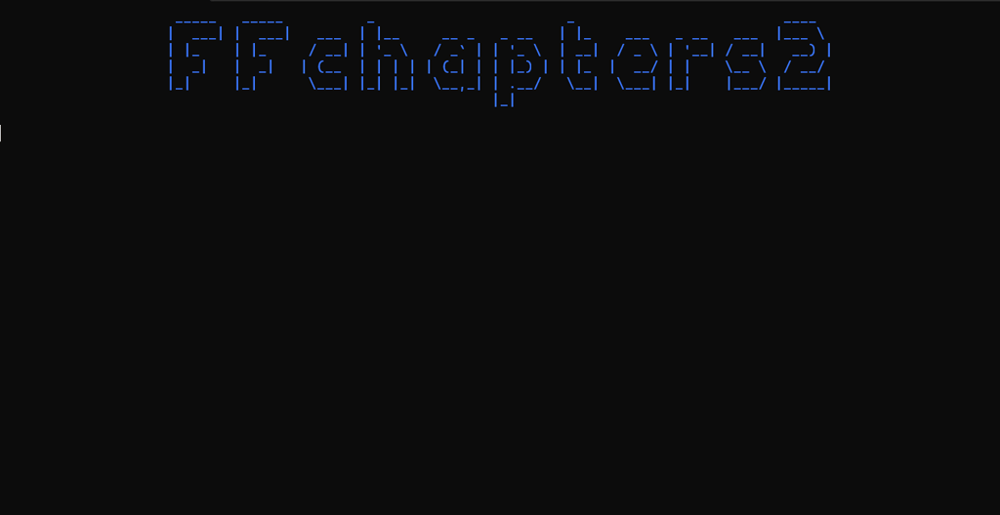

# FFchapters2

## Introduction
FFchapters2 is a FFmpeg based video chapter generation tool.

FFchapters2 uses FFmpeg for frame accurate movie scene change detection and creates a chapter file, suitable for e.g. for Matroska.

## FFmpeg Installation
The required FFmpeg is not bundled with the FFchapters2 release therefore you need to download a FFmpeg binary at the [FFmpeg homepage](https://ffmpeg.org/download.html).
The FFmpeg binary can be utilized by FFchapter2 via the following options:
- the FFmpeg binary is situated in the same folder as the FFchapters2 binary
- the FFmpeg binary can be globally accessed in the OS for e.g. when situated in a $PATH defined folder
- the path to the FFmpeg binary can be in FFchapters2 configured with the commandline switch -f or --ffmpeg

## License / Copyright
FFchapters2 is licensed under GPL-2.0-only.

© Alexander Feuster 2022

## Running Demo

